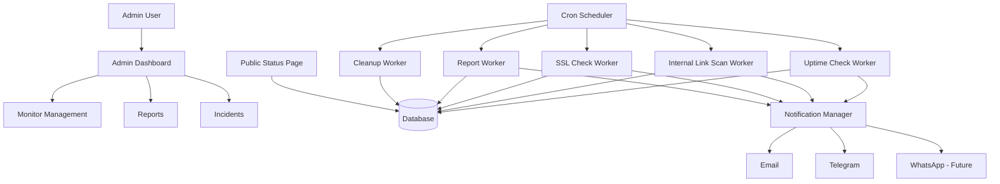

# Ekont Uptime Monitor — Project Planning Document

**Project name:** Ekont Uptime Monitor  
**Target domain:** `https://uptime.kirbas.com`  
**Primary goal:** Monitor the uptime, response health, internal links, and static resources of selected websites; generate reports; and notify administrators when failures occur.  
**Target environment:** Shared or semi-managed hosting with support for PHP, Node.js, Python, MySQL/SQLite, and cron jobs.

---

## 1. Executive Summary

Ekont Uptime Monitor is a lightweight, hosting-friendly monitoring application designed to track the availability and health of selected websites. Unlike a simple uptime checker, the system will also crawl monitored websites and verify whether internal pages, PDF files, images, CSS files, JavaScript files, and other linked resources are accessible.

The application will be accessible from `uptime.kirbas.com` and will provide an administrator dashboard, automated cron-based checks, incident tracking, notification delivery, and daily/weekly reporting.

The recommended implementation strategy is:

- **PHP-based web panel** for maximum hosting compatibility.
- **MySQL** as the primary database engine.
- **Cron jobs** for scheduled uptime checks, link scans, SSL checks, reports, and cleanup tasks.
- **SMTP email and Telegram Bot API** as the first notification channels.
- **WhatsApp integration** as a later phase using Meta WhatsApp Cloud API or a provider such as Twilio.
- **Optional Python/Node.js workers** for advanced crawling, rendering, or future browser-based checks.

---

## 2. Project Objectives

### 2.1 Main Objectives

The application should:

1. Monitor the uptime of selected websites.
2. Measure HTTP response time.
3. Detect website downtime, degraded performance, and recovery.
4. Crawl internal links and static resources of selected websites.
5. Detect inaccessible internal resources such as:
   - Internal pages
   - PDF files
   - Images
   - CSS files
   - JavaScript files
   - Uploaded documents
   - Embedded resources
6. Send alerts through email and Telegram when problems occur.
7. Optionally send WhatsApp alerts for critical incidents.
8. Generate daily and weekly reports.
9. Provide an administrator dashboard.
10. Optionally provide a public or token-protected status page.

### 2.2 Example Monitoring Scenario

A monitored website is:

```text
https://www.kirbas.com
```

During a link scan, the system discovers the following resource:

```text
https://www.kirbas.com/assets/deneme.pdf
```

If this file returns `404 Not Found`, `403 Forbidden`, `500 Internal Server Error`, timeout, DNS failure, or SSL error, the system should record the problem and notify the administrator:

```text
Resource unavailable:
https://www.kirbas.com/assets/deneme.pdf

Found on:
https://www.kirbas.com/downloads

Error:
404 Not Found
```

---

## 3. Scope Definition

### 3.1 In Scope

The initial and planned versions of the system include:

- Website uptime monitoring.
- HTTP/HTTPS status code checks.
- Response time measurement.
- Incident creation and recovery tracking.
- Internal link and resource checking.
- Broken link detection.
- Email notification.
- Telegram notification.
- Daily and weekly reporting.
- Admin dashboard.
- Basic authentication.
- Configurable monitoring intervals.
- Configurable failure thresholds.
- Basic public status page.
- Historical check records.
- CSV export for reports.

### 3.2 Out of Scope for MVP

The first version should not attempt to include every advanced feature. These should be postponed:

- Multi-user role management.
- Complex organization/team management.
- Browser-based rendering with JavaScript execution.
- Full SEO crawler features.
- Distributed multi-region monitoring.
- Complex SLA billing calculations.
- AI-based anomaly detection.
- Native mobile application.
- Advanced WhatsApp workflows.

---

## 4. Recommended Technology Stack

### 4.1 Primary Stack

| Layer | Recommended Technology | Reason |
|---|---|---|
| Admin panel | PHP | Best compatibility with typical hosting environments |
| Database | MySQL | Reliable, widely supported, scalable enough for the project |
| Scheduler | Cron jobs | Available on most hosting platforms |
| HTTP checks | PHP cURL | Lightweight and suitable for uptime monitoring |
| Email | SMTP + PHPMailer | Reliable, secure, widely used |
| Telegram | Telegram Bot API | Simple, fast, low-cost alerting |
| Frontend | Bootstrap 5 or custom CSS | Fast UI development |
| Charts | Chart.js | Lightweight monitoring graphs |
| Config | `.env` or protected config file | Keeps secrets outside the code |

### 4.2 Optional Secondary Stack

| Use Case | Optional Technology |
|---|---|
| Advanced crawler | Python |
| Browser-rendered page checks | Node.js + Playwright |
| Background queue | PHP CLI or Python worker |
| API-first future version | Laravel, Slim, FastAPI, or Express |

### 4.3 Recommended MVP Choice

For this project, the most practical MVP stack is:

```text
PHP + MySQL + Cron + cURL + PHPMailer + Telegram Bot API + Chart.js
```

This combination minimizes deployment complexity while still allowing the system to grow later.

---

## 5. High-Level System Architecture



---

## 6. Main Application Modules

### 6.1 Authentication Module

Responsible for:

- Admin login.
- Password hashing.
- Session management.
- Logout.
- Login attempt rate limiting.
- Optional two-factor authentication in future versions.

Recommended password storage:

```php
password_hash($password, PASSWORD_DEFAULT);
```

### 6.2 Monitor Management Module

Responsible for creating and managing monitored websites.

Each monitor should include:

- Name
- Base URL
- Monitoring type
- Uptime interval
- Timeout
- Expected HTTP status codes
- Response time warning threshold
- Failure threshold
- Recovery threshold
- Link scan enabled/disabled
- Link scan interval
- Maximum crawl depth
- Maximum number of URLs per scan
- Notification channels
- Active/passive status

### 6.3 Uptime Check Module

Responsible for checking whether the main monitored URL is reachable.

It should collect:

- HTTP status code
- Response time in milliseconds
- Error message, if any
- SSL error, if any
- DNS or connection error, if any
- Redirect information

Possible statuses:

```text
unknown
up
degraded
down
```

### 6.4 Incident Management Module

Responsible for:

- Opening incidents when a monitor fails repeatedly.
- Closing incidents when the monitor recovers.
- Calculating outage duration.
- Preventing duplicate incident creation.
- Sending recovery notifications.
- Keeping historical incident records.

### 6.5 Internal Link and Resource Checker Module

Responsible for crawling monitored websites and checking internal links/resources.

This module should:

1. Fetch HTML pages.
2. Extract links and resources.
3. Normalize relative URLs.
4. Filter internal vs external links.
5. Check resource availability.
6. Record discovered links.
7. Record broken links.
8. Send summary alerts when broken resources are detected.

### 6.6 Notification Module

Responsible for sending alerts through multiple channels:

- Email
- Telegram
- WhatsApp in later versions

It should support:

- Alert templates
- Channel-specific formatting
- Alert throttling
- Recovery alerts
- Summary alerts
- Daily/weekly reports

### 6.7 Reporting Module

Responsible for generating:

- Daily uptime report
- Weekly uptime report
- Broken link report
- Incident summary
- Response time summary
- SSL expiration report
- CSV exports

### 6.8 Public Status Page Module

Responsible for displaying selected monitors publicly.

It may show:

- Operational status
- Current incidents
- Recent incident history
- Uptime percentage
- Last update time

Access modes:

```text
public
token_protected
disabled
```

---

## 7. Monitoring Types

The system should be designed to support multiple monitoring types.

| Type | Description | MVP |
|---|---|---|
| HTTP uptime | Checks if a URL is reachable | Yes |
| Response time | Detects slow responses | Yes |
| Internal links | Checks pages and same-domain links | Yes |
| Static resources | Checks images, CSS, JS, PDFs, files | Yes |
| SSL expiry | Warns before certificate expiry | Phase 4 |
| Keyword check | Confirms expected content exists | Phase 4 |
| External links | Checks outbound links | Phase 4 |
| Domain expiry | Warns before domain expiration | Phase 4 |
| Cron heartbeat | Confirms scheduled tasks run | Phase 4 |
| API check | Validates API endpoint responses | Phase 4 |

---

## 8. Uptime Check Logic

### 8.1 Basic Algorithm

```text
1. Cron job starts.
2. Lock file or database lock is checked.
3. Active monitors whose next_check_at <= current time are selected.
4. HTTP request is sent to each monitor URL.
5. Status code, response time, and error details are collected.
6. Result is saved into the checks table.
7. Consecutive success/failure counters are updated.
8. Incident is opened if failure threshold is reached.
9. Incident is closed if recovery threshold is reached.
10. Notifications are sent when needed.
11. next_check_at is recalculated.
```

### 8.2 Status Classification

| Condition | Status |
|---|---|
| HTTP 200/301/302 and acceptable response time | up |
| HTTP 200/301/302 but response time exceeds threshold | degraded |
| Timeout | down |
| DNS failure | down |
| SSL error | down or warning depending on configuration |
| HTTP 500/502/503/504 | down |
| HTTP 404 on main URL | down |
| HTTP 403 on main URL | configurable; usually down or warning |

### 8.3 Failure Threshold

To avoid false alarms, the system should not send an alert after a single failed request.

Recommended default:

```text
failure_threshold = 3
recovery_threshold = 2
```

This means:

- The system opens an incident after 3 consecutive failures.
- The system closes an incident after 2 consecutive successful checks.

### 8.4 Response Time Thresholds

Recommended default values:

| Response Time | Classification |
|---|---|
| 0–1000 ms | normal |
| 1001–3000 ms | warning/degraded |
| > 3000 ms | degraded |
| timeout | down |

These values should be configurable per monitor.

---

## 9. Internal Link and Resource Checking

### 9.1 Purpose

The internal link checker ensures that a monitored website is not only online but also structurally healthy. It detects inaccessible internal pages, missing files, broken images, unavailable PDF documents, missing JavaScript/CSS assets, and other resource problems.

### 9.2 Resources to Extract

The crawler should initially parse the following HTML attributes:

| HTML Element | Attribute | Resource Type |
|---|---|---|
| `<a>` | `href` | page, PDF, file |
| `` | `src` | image |
| `<script>` | `src` | JavaScript |
| `<link>` | `href` | CSS, favicon, canonical |
| `<iframe>` | `src` | embedded page |
| `<source>` | `src` | media source |
| `<video>` | `src` | video |
| `<audio>` | `src` | audio |

### 9.3 Links to Ignore

The crawler should ignore:

```text
mailto:
tel:
javascript:
data:
#fragment-only links
empty links
logout links
admin links, if configured
```

### 9.4 Internal vs External Link Policy

Default behavior:

| Link Type | Default Action |
|---|---|
| Same-domain internal links | Check |
| Same-domain static resources | Check |
| Subdomain links | Configurable |
| External links | Ignore by default |
| External CDN assets | Configurable |
| mailto/tel links | Ignore |

Example:

```text
Base URL:
https://www.kirbas.com

Internal:
/assets/deneme.pdf
https://www.kirbas.com/assets/deneme.pdf
https://kirbas.com/iletisim

External:
https://google.com
https://youtube.com/example
```

### 9.5 URL Normalization Rules

The system should normalize URLs before checking them:

1. Convert relative URLs to absolute URLs.
2. Remove URL fragments such as `#section`.
3. Normalize trailing slashes based on configuration.
4. Decode/encode unsafe characters properly.
5. Avoid checking duplicate URLs in the same scan.
6. Optionally remove tracking query parameters such as:
   - `utm_source`
   - `utm_medium`
   - `utm_campaign`
   - `fbclid`
   - `gclid`

### 9.6 Crawl Depth

The crawler must be limited to avoid overloading the monitored site or the hosting server.

Recommended defaults:

| Setting | Default Value |
|---|---:|
| Maximum crawl depth | 2 |
| Maximum pages per scan | 100 |
| Maximum resources per scan | 300 |
| Request timeout | 10 seconds |
| Delay between requests | 100–500 ms |
| External link checking | disabled |
| Static resource checking | enabled |
| PDF/file checking | enabled |

### 9.7 Link Scan Frequency

Uptime checks can run every 1–5 minutes, but internal link scans should run less frequently.

Recommended schedule:

| Task | Frequency |
|---|---|
| Main uptime check | Every 1–5 minutes |
| Internal link scan | Every 6–24 hours |
| SSL check | Once per day |
| Daily report | Once per day |
| Weekly report | Once per week |
| Cleanup | Once per day |

### 9.8 Resource Checking Method

The checker should use a careful strategy:

```text
1. Try HEAD request first.
2. If HEAD is blocked or unreliable, fallback to GET.
3. For GET requests, avoid downloading large files completely.
4. Use timeout limits.
5. Follow redirects up to a configurable maximum.
6. Record final URL and status code.
```

Some servers do not support `HEAD` correctly. Therefore, `GET` fallback is required.

### 9.9 Broken Link Classification

| Condition | Classification |
|---|---|
| 200 OK | healthy |
| 301/302 redirect | healthy or warning depending on policy |
| 304 Not Modified | healthy |
| 401 Unauthorized | warning |
| 403 Forbidden | warning or broken depending on policy |
| 404 Not Found | broken |
| 410 Gone | broken |
| 429 Too Many Requests | warning |
| 500/502/503/504 | broken |
| Timeout | broken |
| DNS failure | broken |
| SSL error | broken or warning |

### 9.10 Broken Link Notification Policy

The system should avoid sending too many alerts.

Recommended default policy:

```text
If one broken link is found:
    Save it immediately.
    Notify only if it appears in two consecutive scans.

If multiple broken links are found:
    Send one summary notification.

If a previously broken link recovers:
    Mark it as resolved.
    Optionally send recovery notification.
```

For static files such as PDF, CSS, JS, and images, an immediate alert can be allowed because 404 errors are often real issues.

---

## 10. Database Design

### 10.1 `users`

Stores administrator accounts.

```sql
CREATE TABLE users (
    id INT AUTO_INCREMENT PRIMARY KEY,
    name VARCHAR(150) NOT NULL,
    email VARCHAR(190) NOT NULL UNIQUE,
    password_hash VARCHAR(255) NOT NULL,
    is_active TINYINT DEFAULT 1,
    last_login_at DATETIME NULL,
    created_at DATETIME DEFAULT CURRENT_TIMESTAMP,
    updated_at DATETIME NULL
);
```

### 10.2 `monitors`

Stores monitored websites.

```sql
CREATE TABLE monitors (
    id INT AUTO_INCREMENT PRIMARY KEY,
    name VARCHAR(150) NOT NULL,
    url VARCHAR(500) NOT NULL,
    method VARCHAR(10) DEFAULT 'GET',
    expected_status VARCHAR(50) DEFAULT '200,301,302',
    keyword VARCHAR(255) NULL,
    interval_seconds INT DEFAULT 300,
    timeout_seconds INT DEFAULT 10,
    response_warning_ms INT DEFAULT 3000,
    fail_threshold INT DEFAULT 3,
    recovery_threshold INT DEFAULT 2,
    is_active TINYINT DEFAULT 1,
    current_status ENUM('unknown','up','down','degraded') DEFAULT 'unknown',
    consecutive_failures INT DEFAULT 0,
    consecutive_successes INT DEFAULT 0,
    last_check_at DATETIME NULL,
    next_check_at DATETIME NULL,
    link_scan_enabled TINYINT DEFAULT 1,
    link_scan_interval_seconds INT DEFAULT 21600,
    link_scan_max_depth INT DEFAULT 2,
    link_scan_max_urls INT DEFAULT 300,
    link_scan_external TINYINT DEFAULT 0,
    last_link_scan_at DATETIME NULL,
    next_link_scan_at DATETIME NULL,
    created_at DATETIME DEFAULT CURRENT_TIMESTAMP,
    updated_at DATETIME NULL
);
```

### 10.3 `checks`

Stores uptime check results.

```sql
CREATE TABLE checks (
    id BIGINT AUTO_INCREMENT PRIMARY KEY,
    monitor_id INT NOT NULL,
    checked_at DATETIME DEFAULT CURRENT_TIMESTAMP,
    status ENUM('up','down','degraded') NOT NULL,
    http_code INT NULL,
    response_time_ms INT NULL,
    error_message TEXT NULL,
    final_url VARCHAR(1000) NULL,
    redirect_count INT DEFAULT 0,
    FOREIGN KEY (monitor_id) REFERENCES monitors(id),
    INDEX idx_checks_monitor_time (monitor_id, checked_at)
);
```

### 10.4 `incidents`

Stores uptime incidents.

```sql
CREATE TABLE incidents (
    id BIGINT AUTO_INCREMENT PRIMARY KEY,
    monitor_id INT NOT NULL,
    started_at DATETIME NOT NULL,
    resolved_at DATETIME NULL,
    duration_seconds INT NULL,
    reason TEXT NULL,
    last_error TEXT NULL,
    notification_sent TINYINT DEFAULT 0,
    recovery_notification_sent TINYINT DEFAULT 0,
    created_at DATETIME DEFAULT CURRENT_TIMESTAMP,
    updated_at DATETIME NULL,
    FOREIGN KEY (monitor_id) REFERENCES monitors(id),
    INDEX idx_incidents_monitor_time (monitor_id, started_at)
);
```

### 10.5 `link_scan_jobs`

Stores each internal link scan job.

```sql
CREATE TABLE link_scan_jobs (
    id BIGINT AUTO_INCREMENT PRIMARY KEY,
    monitor_id INT NOT NULL,
    started_at DATETIME NOT NULL,
    finished_at DATETIME NULL,
    status ENUM('queued','running','completed','failed') DEFAULT 'queued',
    total_urls INT DEFAULT 0,
    checked_urls INT DEFAULT 0,
    broken_urls INT DEFAULT 0,
    warning_urls INT DEFAULT 0,
    duration_seconds INT NULL,
    error_message TEXT NULL,
    created_at DATETIME DEFAULT CURRENT_TIMESTAMP,
    FOREIGN KEY (monitor_id) REFERENCES monitors(id),
    INDEX idx_link_scan_jobs_monitor_time (monitor_id, started_at)
);
```

### 10.6 `discovered_links`

Stores discovered links and resources.

```sql
CREATE TABLE discovered_links (
    id BIGINT AUTO_INCREMENT PRIMARY KEY,
    monitor_id INT NOT NULL,
    source_url VARCHAR(1000) NOT NULL,
    target_url VARCHAR(1000) NOT NULL,
    normalized_target_url VARCHAR(1000) NOT NULL,
    link_type ENUM('page','image','css','js','pdf','file','iframe','media','other') DEFAULT 'other',
    is_internal TINYINT DEFAULT 1,
    first_seen_at DATETIME DEFAULT CURRENT_TIMESTAMP,
    last_seen_at DATETIME NULL,
    last_checked_at DATETIME NULL,
    last_status_code INT NULL,
    last_status ENUM('unknown','ok','broken','warning') DEFAULT 'unknown',
    last_error TEXT NULL,
    UNIQUE KEY uq_monitor_source_target (monitor_id, source_url(255), normalized_target_url(255)),
    FOREIGN KEY (monitor_id) REFERENCES monitors(id),
    INDEX idx_discovered_links_monitor_status (monitor_id, last_status)
);
```

### 10.7 `broken_links`

Stores active and historical broken resources.

```sql
CREATE TABLE broken_links (
    id BIGINT AUTO_INCREMENT PRIMARY KEY,
    monitor_id INT NOT NULL,
    discovered_link_id BIGINT NULL,
    source_url VARCHAR(1000) NOT NULL,
    target_url VARCHAR(1000) NOT NULL,
    status_code INT NULL,
    error_type VARCHAR(100) NULL,
    error_message TEXT NULL,
    first_detected_at DATETIME NOT NULL,
    last_detected_at DATETIME NOT NULL,
    resolved_at DATETIME NULL,
    occurrence_count INT DEFAULT 1,
    notification_sent TINYINT DEFAULT 0,
    recovery_notification_sent TINYINT DEFAULT 0,
    FOREIGN KEY (monitor_id) REFERENCES monitors(id),
    FOREIGN KEY (discovered_link_id) REFERENCES discovered_links(id),
    INDEX idx_broken_links_monitor_status (monitor_id, resolved_at)
);
```

### 10.8 `notification_channels`

Stores notification channel configuration.

```sql
CREATE TABLE notification_channels (
    id INT AUTO_INCREMENT PRIMARY KEY,
    type ENUM('email','telegram','whatsapp') NOT NULL,
    name VARCHAR(100) NOT NULL,
    config_json TEXT NOT NULL,
    is_active TINYINT DEFAULT 1,
    created_at DATETIME DEFAULT CURRENT_TIMESTAMP,
    updated_at DATETIME NULL
);
```

### 10.9 `monitor_notification_channels`

Maps monitors to notification channels.

```sql
CREATE TABLE monitor_notification_channels (
    monitor_id INT NOT NULL,
    channel_id INT NOT NULL,
    PRIMARY KEY (monitor_id, channel_id),
    FOREIGN KEY (monitor_id) REFERENCES monitors(id),
    FOREIGN KEY (channel_id) REFERENCES notification_channels(id)
);
```

### 10.10 `notification_logs`

Stores sent notification records.

```sql
CREATE TABLE notification_logs (
    id BIGINT AUTO_INCREMENT PRIMARY KEY,
    monitor_id INT NULL,
    channel_id INT NULL,
    event_type VARCHAR(100) NOT NULL,
    recipient VARCHAR(255) NULL,
    subject VARCHAR(255) NULL,
    message TEXT NOT NULL,
    status ENUM('pending','sent','failed') DEFAULT 'pending',
    error_message TEXT NULL,
    sent_at DATETIME NULL,
    created_at DATETIME DEFAULT CURRENT_TIMESTAMP,
    FOREIGN KEY (monitor_id) REFERENCES monitors(id),
    FOREIGN KEY (channel_id) REFERENCES notification_channels(id)
);
```

### 10.11 `settings`

Stores global system settings.

```sql
CREATE TABLE settings (
    id INT AUTO_INCREMENT PRIMARY KEY,
    setting_key VARCHAR(100) NOT NULL UNIQUE,
    setting_value TEXT NULL,
    updated_at DATETIME NULL
);
```

---

## 11. File and Directory Structure

Recommended structure:

```text
ekont-uptime-monitor/
│
├── public/
│   ├── index.php
│   ├── status.php
│   ├── login.php
│   ├── logout.php
│   └── assets/
│       ├── css/
│       │   └── app.css
│       ├── js/
│       │   └── app.js
│       └── img/
│
├── admin/
│   ├── dashboard.php
│   ├── monitors.php
│   ├── monitor_create.php
│   ├── monitor_edit.php
│   ├── monitor_detail.php
│   ├── incidents.php
│   ├── broken_links.php
│   ├── link_scans.php
│   ├── reports.php
│   ├── notification_channels.php
│   └── settings.php
│
├── cron/
│   ├── check_uptime.php
│   ├── check_links.php
│   ├── check_ssl.php
│   ├── daily_report.php
│   ├── weekly_report.php
│   └── cleanup.php
│
├── app/
│   ├── Core/
│   │   ├── Database.php
│   │   ├── Config.php
│   │   ├── Router.php
│   │   ├── Auth.php
│   │   ├── Csrf.php
│   │   └── Logger.php
│   │
│   ├── Services/
│   │   ├── MonitorChecker.php
│   │   ├── IncidentManager.php
│   │   ├── LinkCrawler.php
│   │   ├── UrlNormalizer.php
│   │   ├── ResourceChecker.php
│   │   ├── BrokenLinkManager.php
│   │   ├── ReportService.php
│   │   └── NotificationManager.php
│   │
│   ├── Notifications/
│   │   ├── EmailNotifier.php
│   │   ├── TelegramNotifier.php
│   │   └── WhatsAppNotifier.php
│   │
│   └── Helpers/
│       ├── DateHelper.php
│       ├── HttpHelper.php
│       └── ViewHelper.php
│
├── config/
│   ├── config.php
│   └── env.example
│
├── database/
│   ├── schema.sql
│   ├── seed.sql
│   └── migrations/
│
├── storage/
│   ├── logs/
│   ├── cache/
│   └── exports/
│
├── vendor/
│
├── composer.json
├── README.md
└── plan.md
```

---

## 12. Cron Job Plan

### 12.1 Uptime Check Cron

Runs every minute.

```bash
* * * * * /usr/local/bin/php /home/user/uptime/cron/check_uptime.php
```

The script itself decides which monitors are due based on `next_check_at`.

### 12.2 Internal Link Scan Cron

Runs every 30 minutes, but scans only monitors whose `next_link_scan_at` is due.

```bash
*/30 * * * * /usr/local/bin/php /home/user/uptime/cron/check_links.php
```

### 12.3 Daily Report Cron

Runs once per day.

```bash
0 9 * * * /usr/local/bin/php /home/user/uptime/cron/daily_report.php
```

### 12.4 Weekly Report Cron

Runs every Monday morning.

```bash
0 9 * * 1 /usr/local/bin/php /home/user/uptime/cron/weekly_report.php
```

### 12.5 Cleanup Cron

Runs once per day at night.

```bash
30 3 * * * /usr/local/bin/php /home/user/uptime/cron/cleanup.php
```

---

## 13. Notification Design

### 13.1 Notification Events

The system should support the following event types:

| Event | Description |
|---|---|
| `monitor_down` | Website is down |
| `monitor_recovered` | Website recovered |
| `monitor_degraded` | Website is slow |
| `broken_link_detected` | A broken internal link/resource was found |
| `broken_link_summary` | Multiple broken resources were found |
| `broken_link_recovered` | Previously broken link became available |
| `ssl_expiring` | SSL certificate is expiring soon |
| `daily_report` | Daily report |
| `weekly_report` | Weekly report |
| `system_error` | Internal system error |

### 13.2 Email Alert Example

```text
Subject: [Ekont Uptime Monitor] kirbas.com is DOWN

Website: kirbas.com
URL: https://www.kirbas.com
Status: DOWN
Error: Connection timeout
Consecutive failures: 3
First detected: 2026-05-11 10:14
Last checked: 2026-05-11 10:18

Dashboard:
https://uptime.kirbas.com/admin/incidents/12
```

### 13.3 Telegram Alert Example

```text
🔴 Ekont Uptime Monitor Alert

Website: kirbas.com
Status: DOWN
URL: https://www.kirbas.com
Error: Connection timeout
Time: 2026-05-11 10:18

Dashboard:
https://uptime.kirbas.com/admin/incidents/12
```

### 13.4 Broken Resource Alert Example

```text
🔴 Broken Resource Detected

Website: kirbas.com
Unavailable resource:
https://www.kirbas.com/assets/deneme.pdf

Found on:
https://www.kirbas.com/downloads

Error:
404 Not Found

Dashboard:
https://uptime.kirbas.com/admin/broken-links/18
```

### 13.5 Broken Resource Summary Example

```text
🔴 Broken Link Scan Summary

Website: kirbas.com
New broken resources: 7

Examples:
1. /assets/deneme.pdf — 404
2. /images/logo-old.png — 404
3. /uploads/form.docx — 403
4. /js/old-app.js — 500

Full details:
https://uptime.kirbas.com/admin/link-scans/25
```

### 13.6 Alert Throttling

To avoid notification noise:

- Send the first alert when an incident is opened.
- Do not send repeated alerts every minute.
- Send reminder alerts every 30–60 minutes if configured.
- Send recovery alert when resolved.
- For many broken links, send one summary notification.

---

## 14. Admin Dashboard Design

### 14.1 Dashboard Overview

The dashboard should show:

```text
Total monitors: 24
UP: 22
DOWN: 1
DEGRADED: 1
Active incidents: 1
Broken internal resources: 7
Average response time: 284 ms
24-hour uptime: 99.72%
Last link scan: 2026-05-11 10:30
```

### 14.2 Monitor Cards

Each monitor card may show:

```text
kirbas.com
Status: UP
Response time: 184 ms
Last check: 1 minute ago
24h uptime: 100%
Broken links: 0
```

### 14.3 Monitor Detail Page

Recommended tabs:

| Tab | Content |
|---|---|
| Overview | Current status, uptime percentage, response time |
| Checks | Recent uptime checks |
| Incidents | Outage history |
| Internal Links | Discovered links/resources |
| Broken Resources | Current and historical broken links |
| Link Scans | Scan job history |
| Reports | Daily/weekly summaries |
| Settings | Monitor-specific configuration |

### 14.4 Broken Links Page

Should include filters:

- Monitor
- Status: active/resolved
- HTTP code
- Resource type
- First detected date
- Source page
- Target URL

Columns:

| Column | Description |
|---|---|
| Website | Monitor name |
| Broken URL | Unavailable resource |
| Found on | Source page |
| Type | page/image/pdf/css/js/file |
| Status code | 404, 500, timeout, etc. |
| First detected | Date/time |
| Last detected | Date/time |
| Occurrences | Count |
| Resolved | Yes/no |

---

## 15. Reporting Design

### 15.1 Daily Uptime Report

The daily report should include:

- Total monitored websites.
- Number of healthy websites.
- Number of sites with downtime.
- Overall uptime percentage.
- Incident count.
- Total downtime duration.
- Average response time.
- Slowest website.
- Active broken links.
- Newly detected broken links.

Example:

```text
Daily Uptime Report — 2026-05-11

Total monitors: 18
Healthy monitors: 17
Monitors with incidents: 1
Overall uptime: 99.84%
Total incidents: 2
Total downtime: 14 minutes
Average response time: 242 ms
Slowest website: example.com — 1280 ms
New broken resources: 3
```

### 15.2 Weekly Report

The weekly report should include:

- Weekly uptime per monitor.
- Total incidents.
- Longest incident.
- Most unstable monitor.
- Slowest average response time.
- New broken links.
- Resolved broken links.
- SSL warnings.
- Suggested actions.

### 15.3 CSV Export

CSV exports should be available for:

- Uptime checks.
- Incidents.
- Broken links.
- Link scan jobs.
- Daily summaries.

---

## 16. Public Status Page

### 16.1 Purpose

The public status page allows visitors or customers to see the operational status of selected services.

Example URL:

```text
https://uptime.kirbas.com/status
```

### 16.2 Status Page Modes

| Mode | Description |
|---|---|
| Disabled | No public page |
| Public | Anyone can view |
| Token-protected | Only users with a secret link can view |

### 16.3 Public Page Content

The page may show:

- Service name.
- Current status.
- Last update time.
- Uptime percentage for last 24h/7d/30d.
- Active incidents.
- Recent incidents.

It should not expose sensitive admin data, internal error traces, API keys, or private URLs unless explicitly configured.

---

## 17. Security Requirements

### 17.1 Authentication Security

- Use secure password hashing.
- Enforce strong passwords.
- Protect sessions.
- Regenerate session IDs after login.
- Add login attempt limiting.
- Optionally add 2FA in future versions.

### 17.2 Application Security

- Use PDO prepared statements.
- Escape all output in HTML views.
- Add CSRF tokens to forms.
- Validate all URLs before storing.
- Prevent SSRF risks by restricting private IP ranges if needed.
- Protect `.env` and config files.
- Disable directory listing.
- Use HTTPS.

### 17.3 Cron Security

If cron scripts are triggered over HTTP, they must require a secret token:

```text
https://uptime.kirbas.com/cron/check_uptime.php?token=SECRET
```

Prefer CLI cron execution when available:

```bash
/usr/local/bin/php /path/to/cron/check_uptime.php
```

### 17.4 Notification Security

- Store SMTP credentials securely.
- Store Telegram bot token securely.
- Do not show API tokens in the UI after saving.
- Mask secrets in logs.
- Log notification failures without exposing credentials.

---

## 18. Performance and Hosting Considerations

### 18.1 Avoid Overloading Hosting

The system should:

- Limit concurrent checks.
- Avoid crawling too many URLs in one scan.
- Use reasonable timeouts.
- Use database indexes.
- Clean old check records periodically.
- Keep logs under control.
- Use batch processing for large scans.

### 18.2 Recommended Retention Policy

| Data Type | Retention |
|---|---|
| Raw uptime checks | 30–90 days |
| Aggregated daily stats | 1–3 years |
| Incidents | Permanent or 3 years |
| Broken links | Permanent or 1 year |
| Notification logs | 90–180 days |
| System logs | 30 days |

### 18.3 Cleanup Strategy

The cleanup cron should:

- Delete old raw check records.
- Archive or aggregate old data.
- Delete old notification logs.
- Rotate log files.
- Remove stale temporary cache files.

---

## 19. Development Phases

## Phase 1 — MVP Uptime Monitoring

### Goal

Build the first usable version that monitors website availability and sends basic alerts.

### Features

- Project structure.
- Database schema.
- Configuration system.
- Admin login.
- Monitor CRUD.
- Uptime check cron.
- HTTP status and response time measurement.
- Check history.
- Basic dashboard.
- Incident creation.
- Email notifications.
- Telegram notifications.

### Deliverables

- Working admin panel.
- Monitor creation/editing.
- Working cron-based uptime checks.
- Incident records.
- Email/Telegram alerts.

### Acceptance Criteria

- Admin can log in.
- Admin can add a website.
- Cron checks the website automatically.
- The system records status code and response time.
- The system opens an incident after repeated failures.
- The system sends a notification when an incident opens.
- The system sends a recovery notification when the site recovers.

---

## Phase 2 — Internal Link and Resource Monitoring

### Goal

Extend the system from simple uptime monitoring to internal website health monitoring.

### Features

- HTML crawler.
- URL normalization.
- Internal link extraction.
- Static resource extraction.
- PDF/file checking.
- Broken link detection.
- Link scan job records.
- Broken links dashboard.
- Broken resource notifications.
- Summary alerts for multiple broken links.

### Deliverables

- Internal link scan worker.
- Discovered links table.
- Broken links table.
- Broken links admin page.
- Link scan details page.
- Alert messages for broken resources.

### Acceptance Criteria

- The system can crawl `https://www.kirbas.com`.
- The system can discover internal resources such as `/assets/deneme.pdf`.
- The system records inaccessible resources.
- The system shows broken resources in the admin dashboard.
- The system sends an alert when a resource is unavailable.
- The system does not repeatedly alert for the same unchanged broken link.

---

## Phase 3 — Reporting and Status Page

### Goal

Make the system useful for operational review and external communication.

### Features

- Daily report.
- Weekly report.
- Uptime percentage calculation.
- Average response time calculation.
- Incident duration calculation.
- Broken link summary report.
- Public status page.
- CSV export.
- Basic graphs.

### Deliverables

- Report cron scripts.
- Reports admin page.
- Public status page.
- CSV export functionality.
- Chart.js graphs.

### Acceptance Criteria

- Daily report is generated automatically.
- Weekly report is generated automatically.
- Reports include uptime, incidents, response time, and broken links.
- Public status page displays selected services.
- CSV export works for incidents and broken links.

---

## Phase 4 — Advanced Monitoring and Integrations

### Goal

Add advanced features that make the system closer to professional uptime monitoring platforms.

### Features

- SSL certificate expiration check.
- Domain expiration check.
- Keyword/content check.
- External link checking.
- WhatsApp notification integration.
- Maintenance mode.
- API endpoint.
- Advanced alert rules.
- Notification escalation.
- Backup/export/import.

### Deliverables

- SSL check worker.
- Domain check worker.
- Keyword monitoring.
- WhatsApp notifier.
- Maintenance mode UI.
- REST-like API endpoints.

### Acceptance Criteria

- SSL expiration warnings are sent before certificate expiry.
- Keyword checks can detect missing expected content.
- Maintenance mode suppresses unnecessary alerts.
- WhatsApp alerts work for selected critical monitors.
- API can return monitor statuses.

---

## 20. Core Algorithms

### 20.1 Uptime Check Pseudocode

```text
function runUptimeChecks():
    acquireLock('uptime_check')

    monitors = getActiveMonitorsDueForCheck(now)

    for monitor in monitors:
        result = checkHttpStatus(monitor.url, monitor.timeout)
        saveCheckResult(monitor, result)
        updateMonitorCounters(monitor, result)

        if shouldOpenIncident(monitor, result):
            incident = openIncident(monitor, result)
            sendNotification('monitor_down', monitor, incident)

        if shouldCloseIncident(monitor, result):
            incident = closeIncident(monitor)
            sendNotification('monitor_recovered', monitor, incident)

        updateNextCheckTime(monitor)

    releaseLock('uptime_check')
```

### 20.2 Link Scan Pseudocode

```text
function runLinkScans():
    acquireLock('link_scan')

    monitors = getActiveMonitorsDueForLinkScan(now)

    for monitor in monitors:
        job = createLinkScanJob(monitor)
        queue = [monitor.url]
        visited = set()
        broken = []

        while queue is not empty:
            if reachedMaxUrls(monitor):
                break

            currentUrl = queue.pop()

            if currentUrl in visited:
                continue

            visited.add(currentUrl)
            html = fetchHtml(currentUrl)

            if html failed:
                recordBrokenLink(monitor, currentUrl, currentUrl, error)
                continue

            links = extractLinks(html, currentUrl)

            for link in links:
                normalized = normalizeUrl(link, currentUrl)

                if shouldIgnore(normalized):
                    continue

                saveDiscoveredLink(monitor, currentUrl, normalized)

                if isInternal(normalized) or monitor.external_check_enabled:
                    result = checkResource(normalized)
                    updateDiscoveredLinkStatus(normalized, result)

                    if result is broken:
                        broken.append(normalized)
                        recordBrokenLink(monitor, currentUrl, normalized, result)

                    if isHtmlPage(normalized) and withinDepthLimit(normalized):
                        queue.push(normalized)

        completeLinkScanJob(job, broken)

        if broken count > 0:
            sendBrokenLinkSummary(monitor, job, broken)

        updateNextLinkScanTime(monitor)

    releaseLock('link_scan')
```

---

## 21. UI Pages

### 21.1 Required Admin Pages

| Page | Purpose |
|---|---|
| Login | Admin authentication |
| Dashboard | General system overview |
| Monitors | List monitored websites |
| Add Monitor | Create new monitor |
| Edit Monitor | Update monitor settings |
| Monitor Detail | View monitor-specific health data |
| Incidents | View downtime incidents |
| Broken Links | View inaccessible resources |
| Link Scans | View scan jobs and scan results |
| Reports | View daily/weekly reports |
| Notification Channels | Manage email/Telegram settings |
| Settings | Global system settings |

### 21.2 Public Pages

| Page | Purpose |
|---|---|
| Status | Public system status |
| Incident detail | Optional public incident explanation |

---

## 22. Configuration Parameters

### 22.1 Global Settings

```text
APP_NAME=Ekont Uptime Monitor
APP_URL=https://uptime.kirbas.com
APP_TIMEZONE=Europe/Istanbul
DB_HOST=localhost
DB_NAME=ekont_uptime
DB_USER=...
DB_PASS=...
SMTP_HOST=...
SMTP_PORT=587
SMTP_USER=...
SMTP_PASS=...
TELEGRAM_BOT_TOKEN=...
TELEGRAM_DEFAULT_CHAT_ID=...
CRON_SECRET=...
```

### 22.2 Monitor Defaults

```text
DEFAULT_UPTIME_INTERVAL_SECONDS=300
DEFAULT_TIMEOUT_SECONDS=10
DEFAULT_FAIL_THRESHOLD=3
DEFAULT_RECOVERY_THRESHOLD=2
DEFAULT_RESPONSE_WARNING_MS=3000
DEFAULT_LINK_SCAN_INTERVAL_SECONDS=21600
DEFAULT_LINK_SCAN_MAX_DEPTH=2
DEFAULT_LINK_SCAN_MAX_URLS=300
```

---

## 23. Logging Strategy

The application should log:

- Cron job starts and finishes.
- Uptime check errors.
- Link scan errors.
- Notification sending failures.
- Authentication failures.
- Database errors.
- System exceptions.

Recommended log files:

```text
storage/logs/app.log
storage/logs/cron.log
storage/logs/notifications.log
storage/logs/link_scanner.log
storage/logs/security.log
```

Logs must not contain plain API tokens, SMTP passwords, or sensitive credentials.

---

## 24. Testing Plan

### 24.1 Unit Tests

Test the following components:

- URL normalization.
- Link extraction.
- Resource type detection.
- Status classification.
- Incident threshold logic.
- Notification template generation.
- Uptime percentage calculation.

### 24.2 Integration Tests

Test:

- Monitor creation and check execution.
- Uptime incident opening and recovery.
- Link scan job creation and completion.
- Broken link detection.
- Email sending with test SMTP.
- Telegram sending with test bot.

### 24.3 Manual Test Cases

| Test | Expected Result |
|---|---|
| Add healthy website | Status becomes UP |
| Add invalid URL | Validation error |
| Monitor 404 page | Incident opens after threshold |
| Restore failed URL | Recovery notification sent |
| Add page with broken PDF | Broken resource recorded |
| Add page with broken image | Broken resource recorded |
| Run daily report cron | Report is generated and sent |
| Disable monitor | It is not checked |
| Enable public status page | Public page shows selected monitors |

---

## 25. Deployment Plan

### 25.1 Deployment Steps

1. Create subdomain: `uptime.kirbas.com`.
2. Create database and database user.
3. Upload project files.
4. Configure `.env` or `config.php`.
5. Import `database/schema.sql`.
6. Create initial admin user.
7. Set correct file permissions.
8. Configure cron jobs.
9. Test admin login.
10. Add first monitor.
11. Run uptime cron manually.
12. Run link scan cron manually.
13. Test email notification.
14. Test Telegram notification.
15. Enable scheduled cron jobs.

### 25.2 File Permissions

Recommended permissions:

```text
Files: 644
Directories: 755
storage/: writable
config/: not publicly accessible
```

### 25.3 Web Server Protection

If Apache is used, add `.htaccess` protections:

- Prevent direct access to `config/`.
- Prevent direct access to `storage/`.
- Prevent directory listing.
- Route public requests through `public/` if possible.

---

## 26. Risk Analysis

| Risk | Impact | Mitigation |
|---|---|---|
| Hosting cron limitations | Medium | Use lightweight scripts and due-time logic |
| Too many scanned links | High | Limit crawl depth and URL count |
| False positive alerts | Medium | Use thresholds and retry logic |
| HEAD requests unreliable | Medium | Fallback to GET |
| Notification spam | High | Use alert throttling and summaries |
| Database growth | Medium | Add cleanup and aggregation |
| WhatsApp complexity | Medium | Keep it for later phase |
| Security exposure | High | Use authentication, CSRF, prepared statements, protected config |
| Slow scans | Medium | Limit scan size and use batching |
| Shared hosting timeout | Medium | Process scans in small chunks |

---

## 27. Suggested MVP Milestones

### Milestone 1 — Project Skeleton

- Directory structure.
- Configuration loader.
- Database connection.
- Basic layout.
- Login/logout.

### Milestone 2 — Monitor CRUD

- Add monitor.
- Edit monitor.
- Delete/passivate monitor.
- List monitors.
- Validate URLs.

### Milestone 3 — Uptime Worker

- Cron script.
- HTTP checker.
- Check history.
- Status classification.
- Dashboard status display.

### Milestone 4 — Incident and Notifications

- Incident opening.
- Incident closing.
- Email alert.
- Telegram alert.
- Recovery alert.

### Milestone 5 — Internal Link Checker

- Link extraction.
- URL normalization.
- Resource checks.
- Broken link records.
- Broken link dashboard.

### Milestone 6 — Reports

- Daily report.
- Weekly report.
- CSV export.
- Basic graphs.

---

## 28. Definition of Done

The project can be considered operational when:

1. `https://uptime.kirbas.com` is accessible.
2. Admin login works securely.
3. Monitors can be added and edited.
4. Cron checks run automatically.
5. Website uptime is measured and stored.
6. Incidents are opened and closed correctly.
7. Email alerts work.
8. Telegram alerts work.
9. Internal links and resources can be scanned.
10. Broken resources are detected and displayed.
11. Daily reports are generated.
12. The dashboard clearly shows system status.
13. Old data cleanup is configured.
14. Sensitive configuration is protected.

---

## 29. Recommended Initial Development Order

The most efficient development order is:

```text
1. Create project structure.
2. Create database schema.
3. Build configuration and database layer.
4. Build admin authentication.
5. Build monitor CRUD.
6. Build uptime checker service.
7. Build uptime cron script.
8. Build check history and dashboard.
9. Build incident manager.
10. Add email notifications.
11. Add Telegram notifications.
12. Build link crawler and URL normalizer.
13. Build resource checker.
14. Build broken link manager.
15. Build broken links UI.
16. Add daily and weekly reports.
17. Add public status page.
18. Add SSL and advanced checks.
19. Add WhatsApp integration if needed.
```

---

## 30. Final Recommendation

Ekont Uptime Monitor should be developed as a modular, cron-based PHP application with a strong focus on reliability, simplicity, and hosting compatibility. The system should start with uptime monitoring and notification features, then quickly add internal link and static resource monitoring, because this is one of the most valuable differentiators of the project.

The most important design principle is separation of responsibilities:

- Uptime checks should be frequent and lightweight.
- Internal link scans should be less frequent and bounded.
- Notifications should be throttled and summarized.
- Reports should be generated automatically.
- Admin pages should remain simple, secure, and practical.

With this architecture, Ekont Uptime Monitor can become a useful internal monitoring tool for personal, academic, commercial, and customer-facing websites while remaining lightweight enough to run on existing hosting infrastructure.

---

## 31. Current Implementation Notes

Current live target:

```text
https://www.kirbas.com/uptime
```

The project is currently implemented as a plain PHP application using SQLite on shared hosting. The operational link-scan module is now beyond the original MVP outline in several areas:

- Link scan jobs can be triggered manually from `/link_scans.php`.
- Manual scans run through a detached worker when the host supports shell execution.
- The manual worker supports shared-hosting PHP-CGI/FastCGI behavior by accepting only shell-provided arguments or environment values, while still blocking browser execution.
- Only one link-scan job runs at a time to reduce SQLite lock contention.
- SQLite uses WAL mode and a busy timeout to improve reliability during scans and status polling.
- Link scan jobs publish heartbeat/live-state data for the UI.
- The link scan screen shows active progress, stalled/attention warnings, scan quality summaries, and readable URL-heavy job details.
- Link scan job history, discovered links, broken links, and live scan files can be reset from an authenticated UI action without deleting users, monitors, uptime checks, incidents, notification logs, retry queue data, or ignore rules.

The next major implementation phase should focus on report generation and delivery:

- Daily operational summary report.
- Weekly operational summary report.
- Email delivery using the existing notification infrastructure.
- Telegram delivery using the existing Telegram notifier path.
- Report history screen with resend/download actions.
- Cron workers for scheduled report generation.

Initial reporting implementation is now in place:

- `ReportService` generates daily and weekly plain-text operational summaries.
- `/reports.php` provides preview, manual send, report history, and resend actions.
- `report_runs` stores each generated report and email/Telegram delivery status.
- `cron/daily_report.php` and `cron/weekly_report.php` can be scheduled from hosting cron.
